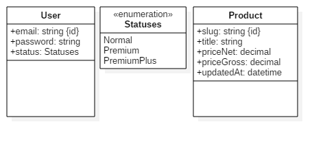

# Scrapper app
[](https://travis-ci.org/w0st/scrapper-ror)
[](https://scrapper-ror.herokuapp.com/)
### Concept
The structure of the database is consistent with below diagram.



### Online version
You can check this app in the action: [here](https://scrapper-ror.herokuapp.com/).
To sign-in you can use below credentials:

|Email|Password|Type of account|
|-----|--------|---------------|
| **normal@domain.com**| **password**| Normal|
| **premium@domain.com**| **password**| Premium|
| **premium_plus@domain.com**| **password**| Premium plus|
 


### Ruby version and dependencies

I used ruby 2.3.0 . Any other dependencies you can check in Gemfile.

### Tests
I've prepared a few specs for controllers and models using Rspec and Capybara.
You can execute them all by type: ```rspec spec/```.